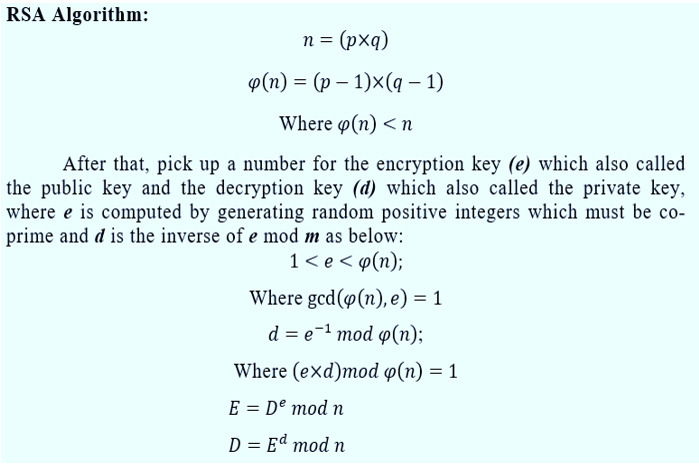

# RSA (Rivest–Shamir–Adleman)

*The original public-key algorithm: encrypt with a public key, decrypt with the
private one, sign with the private key. Its security comes from how hard it is to
factor a large number.*

## What it is

RSA, published in 1977, was the first practical public-key scheme and still shows
up everywhere in TLS certificates and signatures. The public key `(n, e)` is
shared freely; the private key `(n, d)` is kept secret. Anyone can encrypt to you
or verify your signature with the public key, but only you can decrypt or sign.

Security rests on the factoring problem: `n` is the product of two large secret
primes `p` and `q`, and recovering them from `n` is infeasible at modern sizes.

## How it works

Key generation:

1. Pick two large random primes `p`, `q` and set `n = p·q`.
2. Compute `φ(n) = (p−1)(q−1)`.
3. Choose `e` coprime to `φ(n)` — almost always 65537.
4. Compute the private exponent `d = e⁻¹ mod φ(n)`.

Then for `0 ≤ m < n`:

- **Encrypt:** `c = mᵉ mod n`  **Decrypt:** `m = c^d mod n`
- **Sign:** `s = m^d mod n`  **Verify:** `m == sᵉ mod n`

It works because raising to `e` then `d` is the identity mod `n` (Euler's theorem).



## When to use it

- Fine for certificates and signatures, but new systems increasingly prefer
  elliptic curves ([Ed25519](Ed25519.md), [ECDSA](ECDSA.md)) for smaller, faster keys.
- **Always use padding** — OAEP for encryption, PSS for signatures. Textbook RSA
  (raw `mᵉ`) is insecure: deterministic and malleable.
- RSA can only encrypt data smaller than the key, so it wraps a symmetric key
  rather than bulk data. See [symmetric vs. asymmetric](Cryptography-FAQ.md).
- 2048-bit minimum (~112-bit security); 3072-bit for longer horizons.

## Example (Python)

Concise core showing the math. In production use a vetted library (PyCA
`cryptography`) that handles OAEP/PSS padding and safe key sizes.

```python
def keygen(p, q, e=65537):              # real keygen picks p, q at random
    n, phi = p * q, (p - 1) * (q - 1)
    return (n, e), (n, pow(e, -1, phi))

def encrypt(m, pub):  n, e = pub;  return pow(m, e, n)
def decrypt(c, priv): n, d = priv; return pow(c, d, n)
```

Real prime generation uses [Miller-Rabin](Miller-Rabin-Primality-Test.md).

## Can the primes just be precomputed?

No. RSA-2048 uses two random ~1024-bit primes. There are about 10^305 primes that
size — storing them all would take ~10^307 bytes (~10^295 TB), far more than the
universe can hold. Factoring `n` directly is the other route, and the best known
algorithm (GNFS) rates RSA-2048 at ~112-bit security; it has never been broken.
The full worked numbers are in the [Cryptography FAQ](Cryptography-FAQ.md).

## Security notes

- Never use raw/textbook RSA — use OAEP for encryption and PSS for signatures.
- Reusing a prime across two keys, or weak randomness in prime generation, breaks
  everything — see [why randomness matters](Cryptography-FAQ.md).
- Vulnerable to quantum computers via Shor's algorithm — see
  [Post-Quantum Cryptography](Post-Quantum-Cryptography.md).

## See also

- [ECDSA](ECDSA.md) / [Ed25519](Ed25519.md) — smaller-key signature alternatives
- [Miller-Rabin](Miller-Rabin-Primality-Test.md) — how the primes are found
- [Cryptography FAQ](Cryptography-FAQ.md) — key sizes, precomputation, quantum

## References

- RFC 8017: PKCS #1 RSA Cryptography Specifications v2.2
- [Public-key cryptography — Wikipedia](https://en.wikipedia.org/wiki/Public-key_cryptography)
